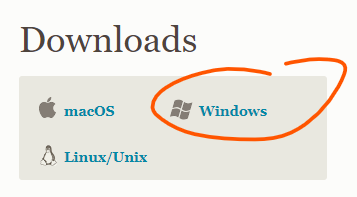
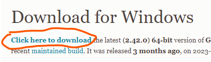
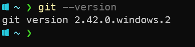

# Git installation guide

Git is a version control system. It is used to keep track of changes in your code. It is also used to collaborate with other developers. To install Git, follow the steps below:

1. Go to [https://git-scm.com/downloads](https://git-scm.com/downloads)
2. Click the download button for your operating system, for example "Windows":
    
3. Click on "Click here to download":
     to download the installer.
4. Run the installer and follow the instructions, you can leave the default settings for everything.
5. Open the command line and type `git --version` to verify that Git is installed correctly. It should look something like this:
    

## Integrating Git with VSCode

VSCode has built-in support for Git, and it should automatically detect it is installed on your computer. You can verify this by opening VSCode and clicking on the "Source Control" icon in the left menu. It should look something like this:

If it looks like this, you are good to go! If not, try restarting VSCode.
