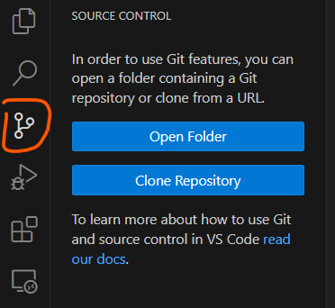

# Git / GitHub

**Git** is a version control system. It is used to keep track of changes in your code. It is also used to collaborate with other developers.

**GitHub** is a website that hosts Git repositories. It is a place where you can store your code, and collaborate with other developers.

## Why use Git?

Git is a *very* powerful tool, and it is used by most professional developers. It is also used by many companies to manage their code. It is a good idea to learn how to use Git, as it will make you a better developer, and it will make it easier for you to collaborate with others. In other words, you **have** to know how to use Git if you want to get hired as a developer.

Plus, it really is just a good habit to get into. It will make your life easier, you will lose less of your work, and it will make you a better developer.

## Install

To install Git, follow the steps below:

1. Go to [https://git-scm.com/downloads](https://git-scm.com/downloads)
2. Click the download button for your operating system, for example "Windows":
    
3. Click on "Click here to download":
     to download the installer.
4. Run the installer and follow the instructions, you can leave the default settings for everything.
5. Open the command line and type `git --version` to verify that Git is installed correctly. It should look something like this:
    

## Integrating Git with VSCode

VSCode has built-in support for Git, and it should automatically detect it is installed on your computer. You can verify this by opening VSCode and clicking on the "Source Control" icon in the left menu. It should look something like this:



If it looks like this, you are good to go! If not, try restarting VSCode.

## Global settings

Before you can start using Git, you need to configure your name and email address. This is used to identify you when you make changes to the code. To do this, open the command line and type the following commands:

```bash
git config --global user.name "Your Name"
git config --global user.email "example@email.com"
```

## Introduction to Git

To use git we must understand how it works. Git is used to track changes to files within a folder. The folder being tracked is called a "repository" and within this repository we can have multiple files. Git will keep track of all changes to these files, and we can view the history of changes at any time. We can either "initialize" a new repository, or "clone" an existing repository from somewhere else (for example GitHub).

When we make changes to any file, or when we add new files, we must tell Git to track these changes. We do this by "staging" the changes (preparing them, letting git know we intend to save their history), and then "committing" them (actually writing those changes into the git history).

## Basic Git commands

- **`git init`**: This initializes a new Git repository. It's the first command you use in a new project to start version tracking.
- **`git clone`**: If you're working with an existing repository, this command is used to copy it to your local machine.
- **`git diff`**: This shows the differences between the current state of the repository and the previous commit. It's used to view changes before adding them to the index.
- **`git add`**: This command stages changes for the next commit. You can add individual files or all changes in the directory.
- **`git commit`**: This saves your staged changes to the local repository. It's accompanied by a message to describe what you've changed.
- **`git status`**: This shows the status of changes as untracked, modified, or staged.
- **`git branch`**: This command lists all local branches in the repository and lets you create or delete branches.
- **`git checkout`**: Used to switch between branches or to check out files and commits.
- **`git merge`**: Merges changes from one branch into another, typically used to combine feature branches with the main branch.
- **`git pull`**: Fetches changes from a remote repository and merges them into your current branch.
- **`git push`**: This sends your committed changes to a remote repository, making them available to others.

These commands form the backbone of most Git operations and are a great starting point for understanding how Git works.

## Git workflow (Local)


The basic Git workflow for working locally on your computer looks like this:

1. Create a new folder for your project
2. Initialize a new Git repository in this folder. This creates a hidden folder called `.git` which contains all the history of your changes. Do not touch this folder unless you know what you are doing. This can be done by:
    - Opening the command line and navigating to the folder, then typing `git init`
    - Or by opening VSCode, clicking on the "Source Control" icon in the left menu, and clicking on "Initialize Repository"
3. Create a new file in this folder, for example `main.py` with some code in it.
4. Once you're happy with your changes, you can stage them by clicking on the "+" icon next to the file in VSCode, or by typing `git add main.py` in the command line.
5. Staged changes can be reviewed again, or if you're happy with them, you can commit them by writing a commit message clicking on the checkmark (✓) icon in VSCode, or by typing `git commit -m "My commit message"` in the command line. The `-m` flag is used to add a message to the commit. These messages are important, they should describe what changes you made in this commit. This is useful when you want to look back at the history of your changes.

You're done! You can now continue making changes to your code, and repeating steps 4 and 5 to save your changes.

## Git workflow (Remote)

We will often want to sync our code with a remote repository, for example GitHub. This is useful when we want to collaborate with other developers, or when we want to share our code with others. Even when working alone, it is a good idea to keep a remote repository as a backup of your code, and to make it easier to work on multiple computers.

We now have 3 choices:

1. Start locally as we did before, and then create a remote repository on GitHub and push our code to it.
2. Start by creating a remote repository on GitHub (or use an existing one), and then clone it to our local computer.

### Option 1: Start locally

1. Repeat steps 1-5 from the previous section for local workflow.
2. Create a new repository on GitHub. You can do this by clicking on the "+" icon in the top right corner, and selecting "New repository".
3. Give your repository a name, and click on "Create repository".
4. Follow the instructions on the page to push your code to GitHub. It should look something like this

```bash
git remote add origin git@github.com:username/test.git
git branch -M main
git push -u origin main
```

Your changes are now pushed to GitHub, and you can continue working on your code. You can push your changes to GitHub at any time by typing `git push` in the command line. You can also pull changes from GitHub by typing `git pull` in the command line.

### Option 2: Start remotely

1. Create a new repository on GitHub. You can do this by clicking on the "+" icon in the top right corner, and selecting "New repository". You can skip this step if you want to use an existing repository, for example if you created one in the previous section.
2. Clone the repository to your local computer. You can do this by clicking on the green "Code" button, and copying the link. Then open the command line, navigate to the folder where you want to clone the repository, and type `git clone <link>`. For example:

```bash
git clone git@github.com:username/test.git
```

You have just pulled all the code from GitHub to your local computer, including the entire history of every change! You can now start working on your code. You can push your changes to GitHub at any time by typing `git push` in the command line. You can also pull changes from GitHub by typing `git pull` in the command line.

## Advanced workflow


When working with others, or even when we are making experimental changes to our own code, we may want to create a new branch. This is useful when we want to make changes to our code, but we don't want to affect the main branch. This is too advanced for this course, but you can read more about it [here](https://www.atlassian.com/git/tutorials/using-branches)
