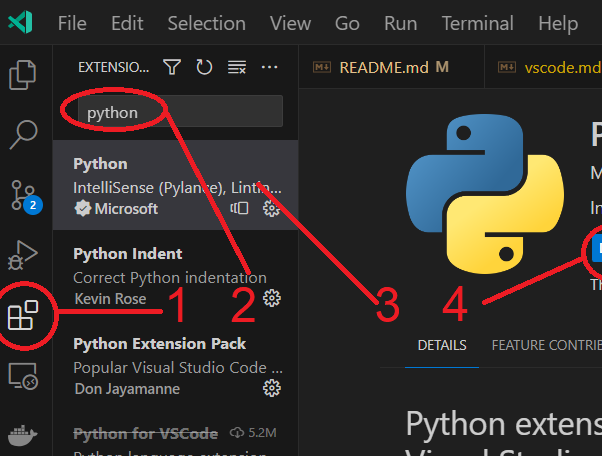

# Integrated Development Environment (IDE)

While Python allows us to work in the command line, it's not very convenient. We'll use an IDE to make our lives easier.

## Visual Studio Code (recommended)

Visual Studio Code is a free source-code editor made by Microsoft for Windows, Linux and macOS. It's a great tool for developing in many programming languages.

### Installation

1. Go to [https://code.visualstudio.com/](https://code.visualstudio.com/)
2. Download the installer for your operating system (for example: Click on the big blue button that says "Download for Windows")
3. Run the installer. Accept the all default settings.

### Plugins

Our primary focus in this course is Python, so we will install a plugin for Python development.

1. Click on the "Extensions" icon in the left sidebar
2. Search for "Python"
3. Click on the first result named "Python"
4. Click "Install"

See the attached screenshot for reference:

## PyCharm (alternative)

PyCharm is a Python IDE made by JetBrains. It's a great tool for developing in Python. It's not better or worse than Visual Studio Code, just different. You can use either one. One advantage of PyCharm is that it has built-in Python support, so you don't need to install any plugins.

1. Go to [https://www.jetbrains.com/pycharm/download/](https://www.jetbrains.com/pycharm/download/)
2. Download the installer for your operating system (for example: Click on the big button that says "Download .exe")
3. Run the installer. Accept the all default settings.
