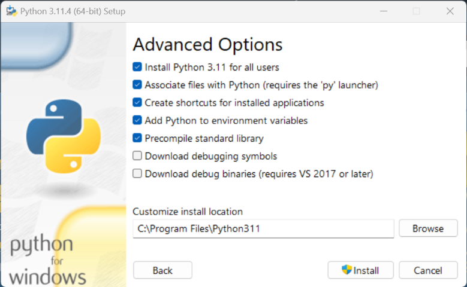

# Installing Python

To install Python, you need to download the official installer from the [Python website](https://www.python.org/downloads/). The installer will guide you through the installation process. We'll prefer using version 3.11 for this course. If you have any other version installed, you can still follow along with the course, but you may encounter some differences.

1. Download the installer from the [Python website](https://www.python.org/downloads/). This should automatically be the correct version for your operating system.

2. Run the installer file you just downloaded.
3. Make sure to check the box that says "Add python.exe to PATH" and click "Customize installation".

4. On the next screen, make sure everything is checked and click "Next".

5. On the next screen, make sure everything is checked like in the image below and click "Install".

## Usage

In Windows, click on the start menu and you should see a new entry called "IDLE (Python 3.11 64-bit)". Click on it to open the Python shell. You can also open the shell by typing "IDLE" in the search bar.

You should see a window like this:

Alternatively, you can open the shell by typing "cmd" in the search bar and then typing "python" in the command prompt.

In that case, you should see something like this:

