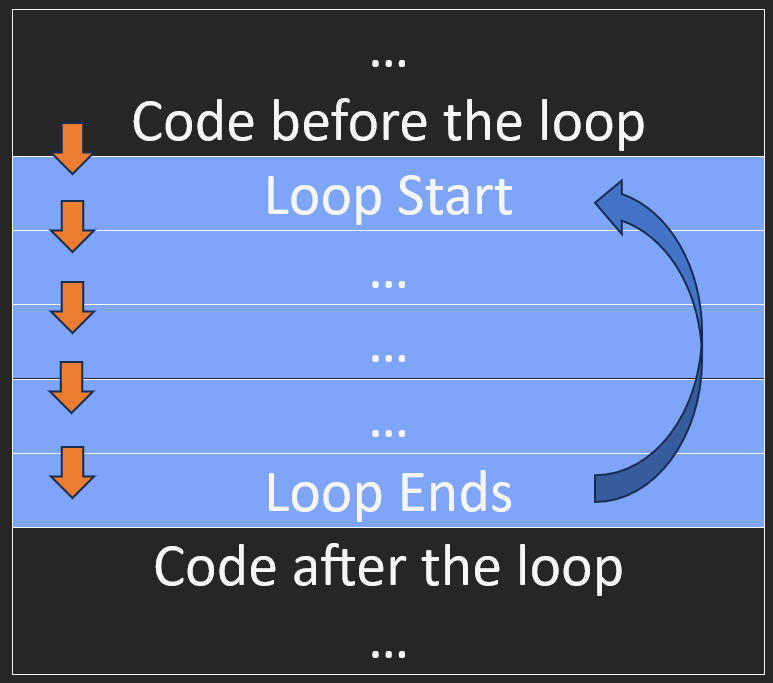
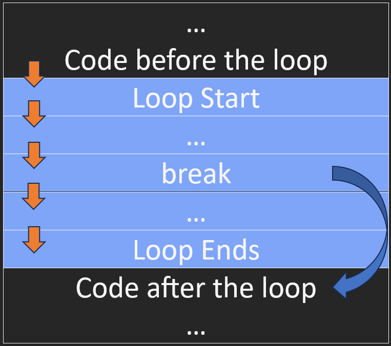
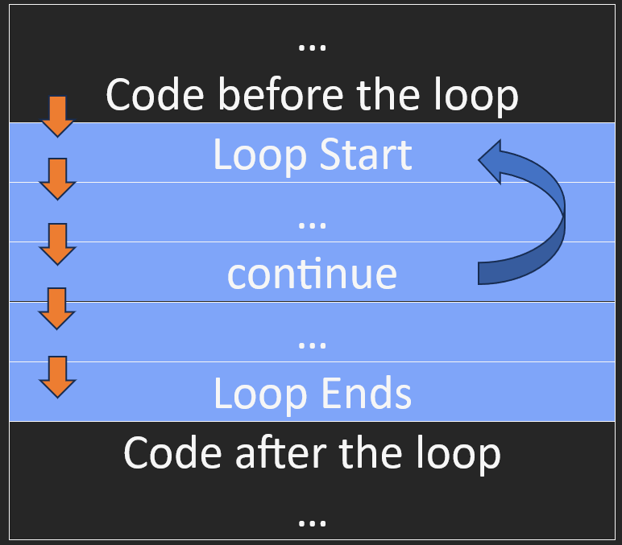

# Loops

Loops are our way to repeat code. We can repeat code a set number of times, or until a condition is met.

## While

The simplest loop is an infinite loop. It will run forever, or until we break out of it.

```python
while True:
    print("Hello")
```



This will print "Hello" forever. The user can break out of the loop by pressing `Ctrl + C` or by closing the terminal. To break out of the loop, we can use the `break` keyword (more on `break` and `continue` keywords later)

```python
print("Starting loop")
counter = 0
while True:
    print("Hello")
    counter = counter + 1
    break

print("Loop ended after " + str(counter) + " iterations because of the break keyword")
```

But while loops are not very useful if we can't change the condition. We can use a variable to control the loop.

```python
print("Starting loop")
counter = 0
while counter < 10:
    print("Hello")
    counter = counter + 1

print("Loop ended after " + str(counter) + " iterations")
```

We have to remember to change the variable inside the loop, or we will get an infinite loop.

```python
print("Starting loop")
counter = 0
while counter < 10:
    print("Hello")
    # We forgot to change the counter variable

print("This will never be printed, we're stuck in an infinite loop")
```

Also, we have to note that if the condition isn't met **before** the loop starts, the loop will never run.

```python
print("Starting loop")
counter = 10
while counter < 10:
    print("We will never get here")
    counter = counter + 1
```

We can use loops to iterate over a list, or any other ordered collection (including `str`).

```python
example_list = ["Hello", "World", "Foo", "Bar"]
index = 0
while index < len(example_list):
    one_item = example_list[index]
    print(one_item)
    index = index + 1
```

But this is a bit cumbersome. We can use a `for` loop instead

## For

A `for` loop is a bit different from a `while` loop. It will iterate over a collection, and we don't have to keep track of the index (or the length) ourselves.

```python
example_list = ["Hello", "World", "Foo", "Bar"]
for one_item in example_list:
    print(one_item)
```

This will print the same as the previous example.

Similarly to `while`, if the collection is empty, the loop will never run.

```python
example_list = []
for one_item in example_list:
    print("We will never get here")
```

## Break

The `break` keyword will break out of the loop. It will stop the loop from running, and continue with the code after the loop.

```python
print("Starting loop")
counter = 0
while True:
    print("Hello")
    counter = counter + 1
    break

print("Loop ended after " + str(counter) + " iterations because of the break keyword")
```



Usually, we will want to `break` out of a loop only if a condition is met (otherwise the loop will only run once). We can use the `break` keyword inside an `if` statement.

```python
print("Starting loop")
counter = 0
while True:
    print("Hello")
    counter = counter + 1
    if counter == 10:
        break

print("Loop ended after " + str(counter) + " iterations because of the break keyword")
```

## Continue

There will be times when we want to skip only one iteration of the loop, and continue with the next one (without using `break` to end the loop). We can use the `continue` keyword to do that.

```python
print("Starting loop")
counter = 0
while True:
    counter = counter + 1
    if counter % 2 == 0:
        continue
    print("Hello")
    if counter == 10:
        break
```



## Other considerations

`break` and `continue` can be used in both `while` and `for` loops.

But be careful, as soon as we hit a line with `break` or `continue`, the loop will stop running that block of code (entirely for `break`, and only the current iteration for `continue`).

```python
print("Starting loop")
counter = 0
while True:
    counter = counter + 1
    if counter % 2 == 0:
        continue
    print("Hello")
    if counter == 10:
        break

print("This will never be printed")
```

Even though we used break, this is an infinite loop. This is because even numbers will be skipped with `continue`, so `counter == 10` will never be true. The skip will happen before the `print` statement and before the condition is checked, so the loop will never end.
