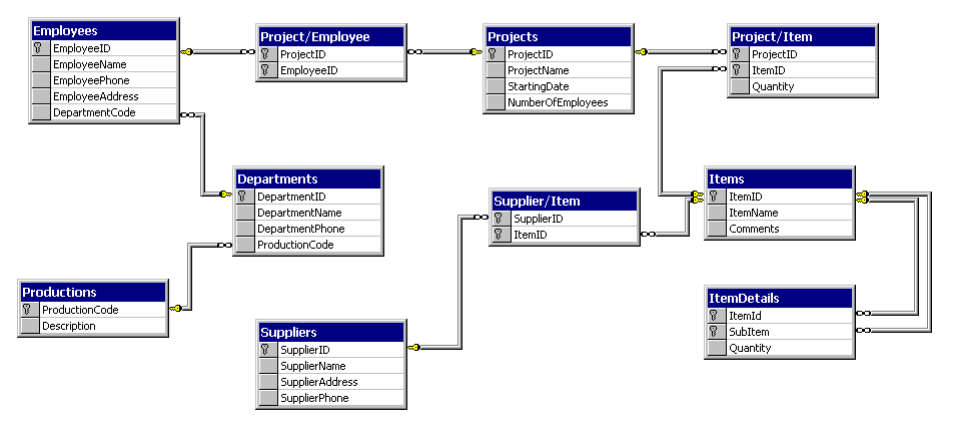

# Advanced SQL

Please make sure to read the [previous SQL document](./sql.md) before continuing with this one.

## Relational databases

Each table has rows and columns, and each row represents a "record" in the table. Records in different tables can be related to each other using keys, which means that we can define relationships between tables. For example, we can have a table of users and a table of posts, and each post can be related to a user. If we also have a table of comments, each comment can be related to a post. We can define what happens when a user is deleted, for example, and the database will automatically delete all the posts and comments related to that user (without us having to write any code for that logic). Alternatively, we can define that the posts and comments will remain in the database, but the user ID will be set to `NULL` (which means that the user is unknown or deleted).



In this diagram we can outline the relationships between records in different tables. For example, employees must have an associated department, and each department can have multiple employees. We shouldn't be able to insert an employee without associating them with a valid department.

Similarly, each employee can have multiple projects, and each project can have multiple employees. If we delete or update a project, we can choose what happens in the table that links employees to projects, and that would depend on out business logic / use case / requirements.

## Primary keys vs. Foreign keys

Primary keys are unique identifiers for each row in a table. They are used to uniquely identify a row in a table. Primary keys are used to enforce entity integrity. A primary key is a column or a set of columns that uniquely identifies each row in a table. A primary key must contain unique values.

Foreign keys are used to link two tables together. A foreign key is a column or a set of columns in a table that is used to establish a link between the data in two tables. A foreign key is a field in a relational table that matches the primary key column of another table. The foreign key can be used to cross-reference tables.

In SQLite, foreign keys are not enforced by default. To enable foreign key constraints, you need to run the following command (once per connection):

```sql
PRAGMA foreign_keys = ON;
```

Also in SQLite, foreign keys in one table, can only be associated with primary keys of other tables. In other words, a foreign key must reference a primary key. This is not necessarily the case in all databases.

This is one of many reasons to prefer more advanced databases like PostgreSQL for larger projects, or in general if you plan on using more advanced features.

## PostgreSQL vs. SQLite

While SQLite is a great database for small projects, PostgreSQL is a more powerful database that is used in many large projects. PostgreSQL is a relational database management system that is open-source and has many advanced features.

Additionally, PostgreSQL is the most popular database in the world, with great documentation and a large community. It is also very fast and reliable, and it has many advanced features that are not available in SQLite (such as advanced data types, built-in functions, and more).

See the chapter about [installing PostgreSQL](postgres.md) for more information on using it locally for development. And see [the official documentation](https://www.postgresql.org/docs/current/index.html) for more information.

### Creating a primary key (SQLite)

```sql
CREATE TABLE users (
    id INTEGER PRIMARY KEY,
    username TEXT
);
```

### Creating a primary key (PostgreSQL)

In PostgreSQL, we have several options for creating a primary key. The first one is the most common one, but we'll include the other examples for reference.

```sql
CREATE TABLE users (
    id INTEGER PRIMARY KEY GENERATED ALWAYS AS IDENTITY,
    -- id INTEGER PRIMARY KEY GENERATED BY DEFAULT AS IDENTITY,
    -- id INTEGER SERIAL PRIMARY KEY,
    username TEXT
);
```

### Creating a foreign key (Both SQLite and PostgreSQL)

```sql
CREATE TABLE posts (
    id INTEGER PRIMARY KEY,
    user_id INTEGER,
    content TEXT,
    FOREIGN KEY (user_id) REFERENCES users(id)
);
```

Because these two tables are related, there are some actions that are not allowed (which is good, because it prevents us from making mistakes).

For example, if we try to insert a post with a user ID that doesn't exist in the `users` table, we will get an error.

A similar error will occur if we try to delete a user that has posts associated with them. We can define what happens in this case, for example, we can delete the posts as well, or we can set the user ID in the posts table to `NULL`.

### ON DELETE & ON UPDATE

When creating a foreign key, we can define what happens when the primary key is deleted or updated. The default is `NO ACTION`, which means that the operation will fail if there are related records. Other options are:

- `CASCADE`: Delete or update the related records as well.
- `SET NULL`: Set the foreign key to `NULL` (column must allow `NULL` values).
- `SET DEFAULT`: Set the foreign key to the default value (column must have a default value, otherwise this is the same as `SET NULL`).

We can define these actions like this:

```sql
CREATE TABLE posts (
    id INTEGER PRIMARY KEY,
    user_id INTEGER,
    content TEXT,
    FOREIGN KEY (user_id) REFERENCES users(id) ON DELETE SET NULL ON UPDATE CASCADE
);
```

In this example, if we update the user ID in the `users` table, the user ID in the `posts` table will be updated as well (the update will "cascade" to the posts table). If we delete a user, the user ID in the `posts` table will be set to `NULL`.

## Joins

A `JOIN` clause is used to combine rows from two or more tables, based on a related column between them. There are several types of joins:

- `INNER JOIN` (or `JOIN`): Returns records that have matching values in both tables.
- `LEFT JOIN` (or `LEFT OUTER JOIN`): Returns all records from the left table, ***and*** the matched records from the right table.
- `RIGHT JOIN` (or `RIGHT OUTER JOIN`): Returns all records from the right table, ***and*** the matched records from the left table.

### INNER JOIN

By far the most useful and common join is the `INNER JOIN`. This join returns only the rows that have matching values in both tables. For example, if we have a table of users and a table of posts, we can join them to get a list of all the posts with the usernames of the users who posted them.

```sql
SELECT users.id AS user_id,
    users.username,
    posts.id AS post_id,
    posts.content
FROM users
    INNER JOIN posts ON users.id = posts.user_id;
    -- JOIN posts ON users.id = posts.user_id;  -- This is the same
```

What we will get is this data, even though this does not exist in this form in any one table:

```plaintext
user_id | username | post_id | content
--------+----------+---------+--------
1       | Alice    | 1       | Hello!
1       | Alice    | 2       | How are you?
2       | Bob      | 3       | I'm good, thanks!
2       | Bob      | 4       | How about you?
```

We won't discuss `LEFT JOIN` and `RIGHT JOIN` in this document, but you can read more about them in the [official documentation](https://www.postgresql.org/docs/current/queries-table-expressions.html#QUERIES-JOIN).
