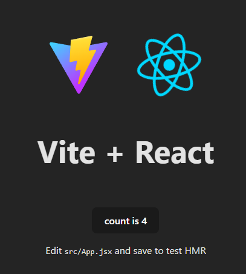

# React / ReactJS

React is a JavaScript library for building user interfaces. It is maintained by Facebook and a community of individual developers and companies. It is one of the most popular JavaScript libraries for building user interfaces.

React has many variations, including React Native, which is used for building mobile applications. We'll focus on React for web development.

## Requirements

We can use React in development mode without installing anything, but for production, we'll need to install Node.js and NPM. You can find the installation instructions for Node.js and NPM [here](../01-introduction/npm.md).

## Development mode

We can include React in our HTML file using a CDN (Content Delivery Network). This is the easiest way to get started with React. We can use the following script tags in our HTML file (in the head section):

```html
<script src="https://unpkg.com/react@18/umd/react.development.js"></script>
<script src="https://unpkg.com/react-dom@18/umd/react-dom.development.js"></script>
```

To verify that React is working, we can add the following script tag at the end of the body section:

```html
<script>
    console.log(React);
    console.log(ReactDOM);
</script>
```

If we open the browser console, we should see the React and ReactDOM objects. This means that React is working correctly.

Notice that we're using the development versions of React and ReactDOM. These versions are larger and slower than the production versions, but they include helpful warnings and error messages. We should use the development versions when we're learning React, and the production versions when we're building our applications.

We can now create our first React component. Add this to the body section of your HTML file:

```html
<div id="root"></div>
<script>
    const element = React.createElement('h1', null, 'Hello, world!');
    ReactDOM.render(element, document.getElementById('root'));
</script>
```

`React.createElement` is a function that creates a React element. It takes three arguments: the type of the element, the properties of the element (we'll use null for now), and the children of the element.

`ReactDOM.render` is a function that renders a React element into the DOM. It takes two arguments: the element to render, and the container to render it into.

If you get a warning in the browser console, about `ReactDOM.render` being deprecated, you can ignore it for now. We'll learn about the new way to render elements in the next sections.

If everything works correctly, you should see "Hello, world!" in the browser.

## JSX

JSX is a syntax extension for JavaScript. It is similar to a template language, but it has full power of JavaScript. JSX produces React "elements". We can use JSX to describe what the UI should look like. Here's an example:

```jsx
const firstName = 'John';
const element = <h1>Hello, {firstName}!</h1>;
```

This is impossible in regular JavaScript. We can use JSX in our React components to describe the UI. We'll learn more about JSX in the next sections.

To use JSX, we'll need to include Babel in our project. Babel is a JavaScript compiler that (among other things) transforms JSX into regular JavaScript. We can use Babel in development mode without installing anything, but for production, we'll need to install Node.js and NPM

## JSX in development mode

We can include Babel in our HTML file using a CDN. This is the easiest way to get started with JSX. We can use the following script tag in our HTML file (in the head section):

```html
<script src="https://unpkg.com/@babel/standalone/babel.min.js"></script>
```

If it works correctly, you should see a warning in the browser console, warning you that you're using the development version of Babel.

We can now use JSX to create a similar "Hello, world!" component. Add this to the body section of your HTML file:

```html
<div id="root"></div>
<script type="text/babel">
    const firstName = 'John';
    const element = <h1>Hello, {firstName}!</h1>;
    ReactDOM.render(element, document.getElementById('root'));
</script>
```

If everything works correctly, you should see "Hello, John!" in the browser.

`script type="text/babel"` tells the browser to use Babel to transform the JSX code into regular JavaScript. This is why we included Babel in our HTML file. If it's not included, nothing will work, but usually no helpful error message will be shown in the browser console either.

This time, we used JSX to create the element. We used `{}` to include a JavaScript expression inside the JSX. We'll learn more about JSX in the next sections.

## Production mode

Moving to production mode is not as simple as including the production versions of React and ReactDOM. Here's a list of things we'll need to do / have:

1. Node.js and NPM, to install packages and run scripts.
2. A compiler like Babel, to transform our JSX code into regular JavaScript.
3. A bundler like Webpack or Parcel, to bundle and "minify" our JavaScript files.
4. A development server, to serve our files and handle requests for our development environment.
5. Properly configured files, such as `package.json`, `webpack.config.js`, `.babelrc`, etc.

We'll learn about all of these in the next sections.

Since this is a lot of work, we'll use [Vite](https://vitejs.dev/) to simplify the process. You can think of Vite as the easy all-in-one solution for React development. It includes everything we need to get started with React in production mode.

## Vite

First, make sure you followed the steps [here](../01-introduction/npm.md) and `npm` is working from your terminal. To start using vite, simply run the following command in your terminal:

```powershell
npm init --yes vite@latest my-new-app -- --template react
```

This will create a new folder called `my-new-app` (you can select any other name here) and install all the necessary packages. You can navigate to the folder and run the following commands:

Alternatively, you can run the following command in your terminal:

```powershell
npm init vite@latest
```

Vite will ask for your project name (and create a folder with that name), and the template to use (we'll use `react`). It will also ask if you want to use JavaScript or TypeScript (we'll use JavaScript).

After the project is created, you can navigate to the project folder and run the following commands:

```powershell
npm install
# You should see a lot of packages being installed
npm run dev
```

This will start the development server. You can open your browser and navigate to `http://localhost:5173` to see your React application. (Change the port number if vite outputs a different port number).

The output in the terminal should be similar to this:

```powershell
  VITE v5.1.4  ready in 349 ms

  ➜  Local:   http://localhost:5173/
  ➜  Network: use --host to expose
  ➜  press h + enter to show help
```

And your browser should show the Vite + React welcome page



You can now start building your React application. You can edit the files in the `src` folder and see the changes in the browser. You can also add new files and components, and Vite will automatically update the browser (as long as the development server is running).
