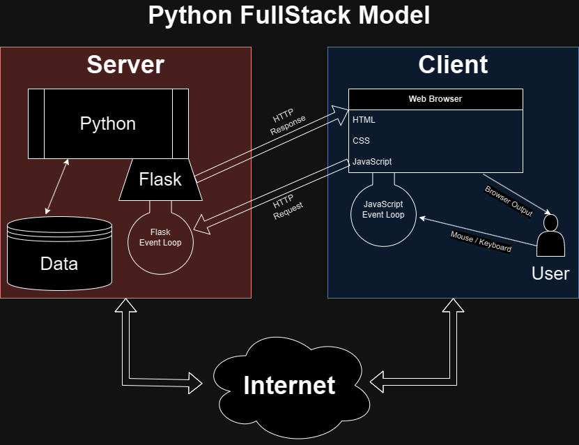

# Python fullstack

Course material for "Python Fullstack"

## Table of contents

1. Installing Requirements
    1. [Installing Python](./01-introduction/install.md)
    2. [Installing an IDE](./01-introduction/ide.md) (Visual Studio Code or PyCharm)
    3. [Recommended plugins (VSCode)](./01-introduction/plugins.md)
    4. [Git](./01-introduction/git.md)
    5. [Node/NPM](./01-introduction/npm.md)
    6. [PostgreSQL](./04-external/postgres.md)
    7. [Docker](./04-external/docker.md)
2. Python basics
    1. [Hello World](./01-introduction/hello.md)
    2. [Variables](./01-introduction/variables.md)
    3. [Data types (Primitive)](./01-introduction/types-primitive.md)
    4. [Data types (Collections)](./01-introduction/types-collections.md)
    5. [Conditions](./01-introduction/conditions.md)
    6. [Functions (Simple)](./01-introduction/functions-simple.md)
    7. [Loops](./01-introduction/loops.md)
    8. [Data types (Collections - Dictionary)](./01-introduction/types-dict.md)
    9. [Files - Reading and writing](./01-introduction/files.md)
    10. [PyPi / pip - Installing packages](./01-introduction/pip.md)
3. Advanced Python
    1. [Error handling (try...except)](./03-advanced/error-handling.md)
    2. [Classes - Basic OOP](./03-advanced/classes-01.md)
    3. [One-liners - List comprehension](./03-advanced/one-liners.md)
    4. [One-liners - Ternary `if-else`](./03-advanced/one-liners.md)
    5. [Advanced String formatting](./03-advanced/string-formatting.md)
    6. [Advanced functions](./03-advanced/functions-advanced.md)
    7. [Advanced functions - wrapping / decorators](./03-advanced/functions-decorators.md)
    8. [Advanced classes - `dataclasses`, `@classmethods`, `@staticmethods` and `@property`](./03-advanced/classes-02.md)
    9. [Generators](./03-advanced/generators.md)
    10. [Parallel processing](./03-advanced/parallel-processing.md)
    11. [Unit testing](./04-external/pytest.md)
    12. [Environment variables](./03-advanced/env-vars.md)
4. External Python Packages (PyPi / pip)
    1. [PyPi / pip - Installing packages](./01-introduction/pip.md)
    2. [`pytest` - Unit testing](./04-external/pytest.md)
    3. [`flask` - Web framework](./04-external/flask.md)
    4. [`python-dotenv` - Environment variables](./03-advanced/env-vars.md#working-example)
5. Exercises / Algorithms
    1. [Basic math + Modulus](./02-basic-exercises/a.py)
    2. [Convert minutes to hours/minutes/seconds](./02-basic-exercises/b.py)
    3. [Basic formatting (decimal places)](./02-basic-exercises/c.py)
    4. Trivia game. [Starting code](./02-basic-exercises/d_trivia_1.py) | [Rolling project](./projects/trivia.py)
    5. [Basic functions](./02-basic-exercises/e_functions_1.py) | [Solutions](./02-basic-exercises/e_functions_1_solution.py)
    6. [Prime numbers](./02-basic-exercises/f_primes.py) | [Solutions](./02-basic-exercises/f_primes_solution.py)
    7. [Advanced functions](./02-basic-exercises/g_functions_2.py) | [Solutions](./02-basic-exercises/g_functions_2_solution.py)
6. Rolling projects
    1. [Trivia game](./projects/trivia/main.py) (Continued from [Basic exercises](./02-basic-exercises/d_trivia_1.py))
    2. [Poker](./projects/poker/main.py)
    3. [Tic Tac Toe](./projects/tictactoe/main.py)
    4. [Library](./projects/library/README.md)
    5. [Sales website](./projects/sales-website/README.md)
    6. Shop frontend in React - [GitHub](https://github.com/ofersadan85/front-demo) and [Demo](https://ofersadan85.github.io/front-demo/)
7. Tools
    1. [Git](./01-introduction/git.md)
    2. GitHub - Will be added later
    3. [SQL / SQLite / Databases](./04-external/sql.md)
    4. [Advanced SQL](./04-external/sql-advanced.md)
    5. [Docker](./04-external/docker2.md)
    6. [Docker Build - Dockerfile](./04-external/docker3.md)
    7. [Docker Cheat-Sheet & Docker Compose](./04-external/docker4.md)
8. Web
    1. [HTTP Basics](./05-web/http.md)
    2. [HTML](./05-web/html.md)
    3. [CSS](./05-web/css.md)
    4. `flask` - Python Web framework
        1. [Introduction](./04-external/flask.md)
        2. [Writing our own flask clone](./04-external/flask-clone.md)
        3. [Templates](./04-external/flask-templates.md)
    5. JavaScript
        1. [Basics](./05-web/js1.md)
        2. [Getters and Setters](./05-web/js2.md)
        3. [JavaScript weirdness](./05-web/js3.md)
    6. React
        1. [Intro](./05-web/react1.md)

## Final project

Your final project will be to create a full-stack web application. The project is graded based on 3 main categories:

1. Data models (20%) - This is everything related to the database, but also how data is structured (classes, functions, etc.) in your code (both frontend and backend).
2. Fullstack (70%) - Your application should work as expected, and include all the features that you've planned. This includes the frontend, backend, and any other parts of the application (like tests, documentation, etc.). The application should run at least on the your local machine.
3. Cloud / Production (10%) - Your application should be deployed to a cloud service. This must include Docker, and a CI/CD pipeline. This must also include some logic to handle different environments (like development, production, etc.).

In general, your project must meet the following requirements:

### Git / GitHub

Your project must be committed to a GitHub repository. You must remember to properly `.gitignore` files that should not be committed (like `.env` files, `node_modules`, etc.).

Your project should be documented in the `README.md` file, including a description of the project, how to run it, and any other relevant information. For example, if cloning the repository requires setting up environment variables (that aren't committed to git), you should include that information in the `README.md`.

### Frontend

You may choose to create a frontend in React, or use "Jinja" templates in Flask / Django. However, if you choose to use Flask templates, your max score (in a perfect project) will be 90. If you choose to use React, your max score will be 100.

Your application must include:

- 10 pages / screens (minimum). A page / screen means a different UI that the user can interact with. For example, a shopping website might have a home page, a product page, a cart page, a checkout page, etc. There's no requirement for the screens to have different URLs, but they must be different in terms of UI. Each screen must have a different purpose and actions that the user can take (like adding an item to the cart, or checking out). There's no problem reusing the same template / components for different screens, as long as the content is different.
- At least 3 different user types, other than "guest" users (like "admin", "customer", "manager", etc.). Each user type must have different permissions and actions that they can take. For example, an admin might be able to delete products, while a customer can only view them. This should be **enforced** on the backend, but the frontend should also hide / show buttons and links based on the user type.
- If using forms for user input, you may skip validation on the frontend, but it's highly recommended to include it. Validation **must** be done on the backend. In either case, the user must receive feedback if the input is invalid. For example, if the user tries to register with an invalid username, they should see a message telling them what's wrong.
- There is no requirement for the frontend to be "pretty" or "modern", but it must be functional and easy to use. You may use CSS frameworks like Bootstrap, but it's not required. You may also include any other frontend libraries or tools that you like, but they must be included directly in the project (no CDN links).
- Documentation: You do not have to include documentation for every function, but if something is not obvious, you should include a comment explaining what it does. You should also include a `README.md` file with instructions on how to run the frontend, how to build it, etc.
- It's **not** a requirement to include tests for the frontend, but of course, it can't hurt. You may use any testing library or tool that you like.

It's not a requirement to include tests for the frontend, but it's highly recommended. You may use any testing library or tool that you like.

### Backend

The backend must be written in Python, using Flask / Django / FastAPI. You may use any other libraries or tools that you like, but they must all be included in the `requirements.txt` file (preferably with versions numbers as well, so there won't be any mismatches between your development environment and the grading environment). The grading environment will use Python 3.12 by default, but you may specify a different version in your `README.md` file.

Your application must include:

- Folder / file structure that makes sense. There's no specific template you should follow, but it should be clear where each part of the application is located. For example, all the models should be in one folder, all the views in another, etc. Definitely don't put everything in one `main.py` file.
- Classes that represent the different entities in your application. For example, if you're creating a library application, you might have classes for `Book`, `Author`, `User`, etc. These don't have to match exactly with the database tables, but they should be close.
- As mentioned in the "Frontend" section, at least 3 different user types, other than "guest" users (like "admin", "customer", "manager", etc.). Each user type must have different permissions and actions that they can take. While this can be validated on the frontend, it **must** be enforced on the backend. For example, if a user tries to delete a product that they don't have permission to delete, the backend should return an error.
- Your application must be able to handle bad data / bad user input. For example, if a user tries to send a request with a username that's actually a number, or send a string where we expect a list etc. You are not expected to handle every possible edge case, but you should handle the most common ones.
- Your application must include tests. You do not have to test every trivial case, but test edge cases where you want to be sure that everything is working as expected. While it's preferable to use `pytest`, you may use any testing library or tool that you like, but it must be included in the `requirements.txt` file. You should also include instructions on how to run the tests in the `README.md` file.
- Documentation: You do not have to include documentation for every function, but if something is not obvious, you should include a comment explaining what it does. You should also include a `README.md` file with instructions on how to run the backend, how to run the tests, etc.

### Database

You must use a database in your application. You may use SQLite, PostgreSQL, or any other database that you like. In either case, you have to include instructions on how to set up an example database that works with your application. This can be done using a script, or by including a `.sql` file that can be imported into the database.

You do not have to include any specific features when using a database (like foreign keys, stored procedures, etc.), but it's highly recommended and will probably make your life easier.

### Cloud / Production

While this is the most advanced part of the project, it's also the smallest part of your grade. So focus on getting the application right before moving on to this part.

Having said that, it will be very helpful if you keep this part in mind while developing the application. For example, it will be easier to deploy the application to a cloud service if you're already using environment variables for configuration, or if you're using Docker for development.

Requirements for this part include:

- Server: Your application must include a `Dockerfile` that can be used to build a Docker image for the backend / server.
- Client: Your application must include a `Dockerfile` that can be used to build a Docker image for the frontend / client.
- Readme: Your grade for this part is mostly about seeing you understand the difference between your development environment and a production environment. So you should include information on how to build the Docker images, how to run them, and what environment variables are needed to be set. Basically, if someone else (like me) wants to run your application, they should be able to do it by following the instructions.
- Docker Compose: While it's not a requirement, it's highly recommended to include a `docker-compose.yml` file that can be used to run the entire application (frontend, backend, and database) with a single command. This is not required, but it will make your life easier, and it's a good practice to use Docker Compose for local development as well.

Theoretically, a project deployment could be as simple as the following steps:

1. Clone the repository.
2. Change environment variables to match the current environment.
3. Run `docker-compose up` to start the application.

## Good luck

Writing a full-stack application is a big task, but it's also a great opportunity to show off everything you've learned in this course. Take it one problem at a time, and don't be afraid to ask for help if you get stuck.

Teaching this course has been a pleasure, and I hope you've enjoyed it as well. I'm looking forward to seeing your projects, and I'm sure you'll do great.
