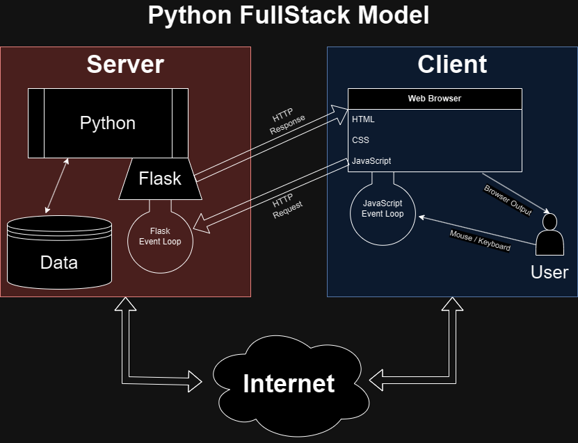

# Python Fullstack Course Material

Welcome to the Python Fullstack course material repository. This guide provides all the resources you need to become proficient in both Python and web development fundamentals.

---

## Quick Navigation

- [Installation and Setup](#installation-and-setup)
- [Python Basics](#python-basics)
- [Advanced Python](#advanced-python)
- [External Python Packages](#external-python-packages)
- [Exercises and Algorithms](#exercises-and-algorithms)
- [Rolling Projects](#rolling-projects)
- [Development Tools](#development-tools)
- [Web Development](#web-development)

---

## Installation and Setup

Click to expand!

1. [Installing Python](./01-introduction/install.md)
2. [Installing an IDE (Visual Studio Code or PyCharm)](./01-introduction/ide.md)
3. [Recommended plugins for VSCode](./01-introduction/plugins.md)
4. [Git](./01-introduction/git.md)

## Python Basics

Click to expand!

1. [Hello World](./01-introduction/hello.md)
2. [Variables](./01-introduction/variables.md)
3. [Data Types - Primitive](./01-introduction/types-primitive.md)
4. [Data Types - Collections](./01-introduction/types-collections.md)
5. [Conditions](./01-introduction/conditions.md)
6. [Simple Functions](./01-introduction/functions-simple.md)
7. [Loops](./01-introduction/loops.md)
8. [Dictionaries](./01-introduction/types-dict.md)
9. [File Operations](./01-introduction/files.md)
10. [Using pip to Install Packages](./01-introduction/pip.md)

## Advanced Python

Click to expand!

1. [Error Handling (try...except)](./03-advanced/error-handling.md)
2. [Introduction to OOP with Classes](./03-advanced/classes-01.md)
3. [Efficient One-liners](./03-advanced/one-liners.md) (Including List Comprehension and Ternary `if-else`)
4. [Advanced String Formatting](./03-advanced/string-formatting.md)
5. [Decorators and Advanced Functions](./03-advanced/functions-advanced.md)
6. [Data Classes and More on OOP](./03-advanced/classes-02.md)
7. [Generators](./03-advanced/generators.md)
8. [Parallel Processing](./03-advanced/parallel-processing.md)
9. [Unit Testing with pytest](./04-external/pytest.md)

## External Python Packages

Click to expand!

1. [Using pip for Package Management](./01-introduction/pip.md)
2. [Unit Testing with pytest](./04-external/pytest.md)
3. [Web Development with Flask](./04-external/flask.md)

## Exercises and Algorithms

Click to expand!

1. Basic mathematical operations and exercises.
2. Time conversion tasks.
3. Number formatting.
4. [Trivia Game Project](./projects/trivia.py) - Start to finish guide.
5. Functions practice.
6. Exploring prime numbers.
7. Advanced functions.

## Rolling Projects

Click to expand!

1. [Trivia Game](./projects/trivia/main.py)
2. [Poker Game](./projects/poker/main.py)
3. [Tic Tac Toe](./projects/tictactoe/main.py)
4. [Library Management System](./projects/library/README.md)
5. [E-commerce Website](./projects/sales-website/README.md)

## Development Tools

Click to expand!

1. [Git](./01-introduction/git.md)
2. GitHub (To be added)
3. [SQL and Databases](./04-external/sql.md)
4. Docker (To be added)

## Web Development

Click to expand!

1. [Understanding HTTP](./05-web/http.md)
2. [Basics of HTML](./05-web/html.md)
3. [Introduction to CSS](./05-web/css.md)
4. Flask - Deep dive into Python web framework.
    - [Starting with Flask](./04-external/flask.md)
    - [Creating a Flask Clone](./04-external/flask-clone.md)
    - [Flask Templates](./04-external/flask-templates.md)
5. JavaScript - From basics to advanced concepts.
    - [JavaScript Basics](./05-web/js1.md)
    - [Understanding Getters and Setters](./05-web/js2.md)
    - [JavaScript Quirks](./05-web/js3.md)
6. React (To be added)

---

We hope this guide helps you in your journey to becoming a full-stack developer with Python. Happy coding!

