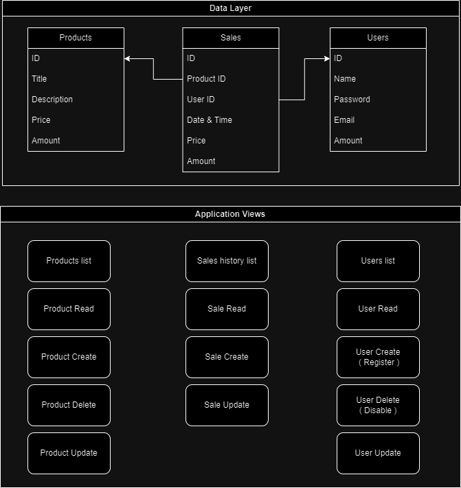

# Sales website

We'll plan our website and database structure in the following way:



## Folder Structure

To keep things ordered, we will be using the following structure:

```sh
├── main.py            # Main app configuration
├── db.py              # Database connection logic
├── models             # Classes representing the database tables and functions to manipulate them
├── requirements.txt   # The requirements file describing the project dependencies
├── static             # The static files (that will be sent to the browser)
│   ├── css            # CSS files
│   ├── images         # Image files
│   └── js             # JavaScript files
├── views              # The Python files that will contain the Flask routes / Blueprint routes
└── templates          # The HTML template files
```
